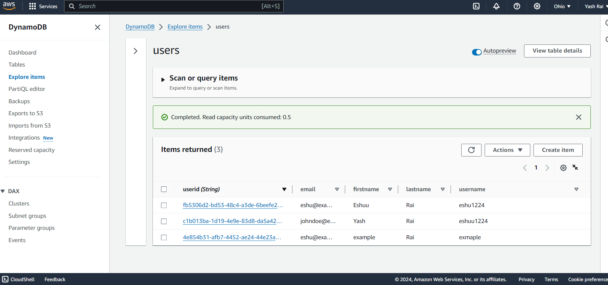

# FastAPI CRUD with DynamoDB

This FastAPI application provides a simple CRUD API to interact with a DynamoDB table for managing user data.

## Prerequisites

- Python 3.7+
- AWS Account with DynamoDB access
- AWS Credentials set up in `.env` file

## Installation

1. Clone the repository:
   ```bash
   git clone https://github.com/yourusername/fastapi-dynamodb-crud.git
   cd fastapi-dynamodb-crud
   ```

2. Create and activate a virtual environment:
   ```bash
   python -m venv venv
   source venv/bin/activate  # On Windows use `venv\Scripts\activate`
   ```

3. Install the dependencies:
   ```bash
   pip install -r requirements.txt
   ```

4. Set up environment variables:
   Create a .env file in the root directory and add your AWS credentials and region:
   ```plaintext
   AWS_ACCESS_KEY_ID=your_access_key_id
   AWS_SECRET_ACCESS_KEY=your_secret_access_key
   AWS_REGION=your_aws_region
   ```




## Running the Application
Start the FastAPI server:
```bash
uvicorn main:app --reload
```
The API will be available at http://localhost:8000.

## API Endpoints

### Check API Status
**Request**
```http
GET /
```
**Response**
```json
{
    "message": "API is running successfully! Try '/get_users' to fetch all users"
}
```

### Create a User
**Request**
```http
POST /add_users
Content-Type: application/json

{
    "name": "John Doe",
    "email": "johndoe@example.com"
}
```
**Response**
```json
{
    "message": "User created successfully",
    "user_id": "generated_user_id",
    "userdetail": {
        "name": "John Doe",
        "email": "johndoe@example.com",
        "userid": "generated_user_id"
    }
}
```

### Get All Users
**Request**
```http
GET /get_users
```
**Response**
```json
[
    {
        "name": "John Doe",
        "email": "johndoe@example.com",
        "userid": "generated_user_id"
    }
]
```

### Get User by ID
**Request**
```http
GET /get_user/{user_id}
```
**Response**
```json
{
    "name": "John Doe",
    "email": "johndoe@example.com",
    "userid": "generated_user_id"
}
```

### Update User by ID
**Request**
```http
PATCH /update_user/{user_id}
Content-Type: application/json

{
    "email": "newemail@example.com"
}
```
**Response**
```json
{
    "userid": "generated_user_id",
    "name": "John Doe",
    "email": "newemail@example.com"
}
```

### Delete User by ID
**Request**
```http
DELETE /delete_user/{user_id}
```
**Response**
```json
{
    "message": "User deleted successfully"
}
```

## License
This project is licensed under the MIT License.
